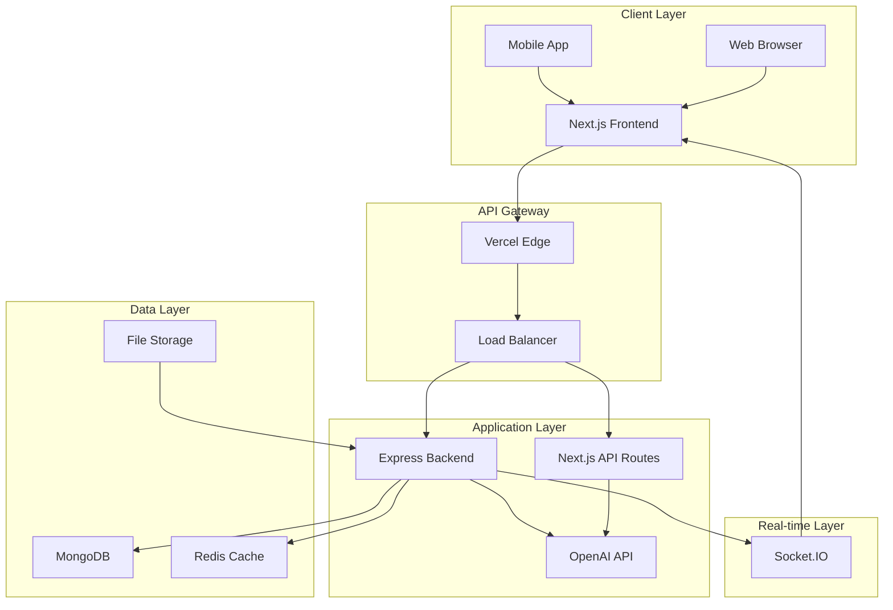
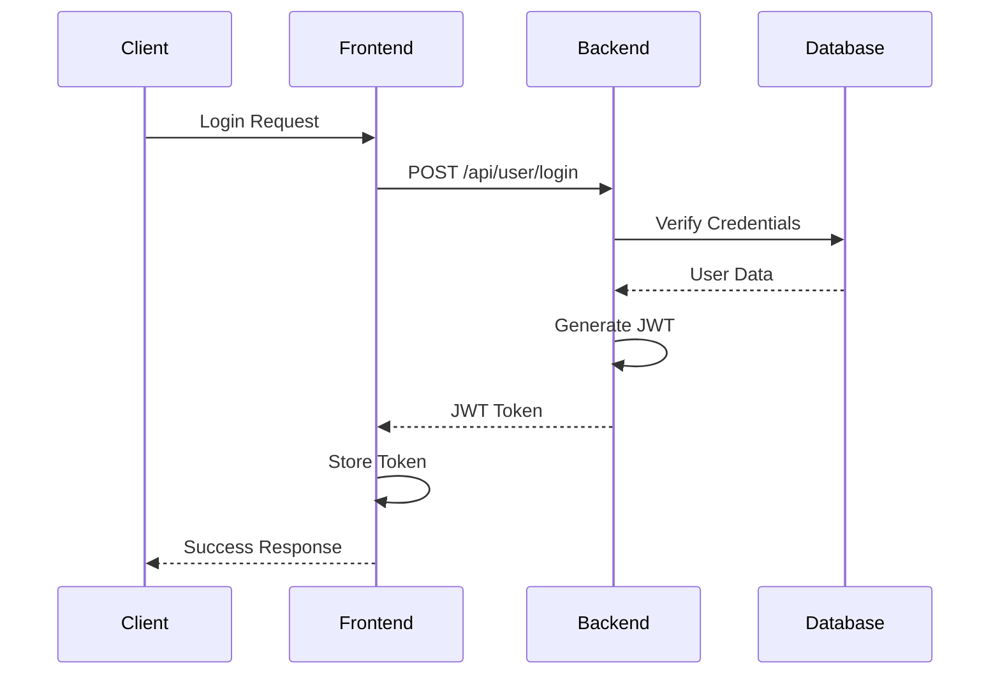
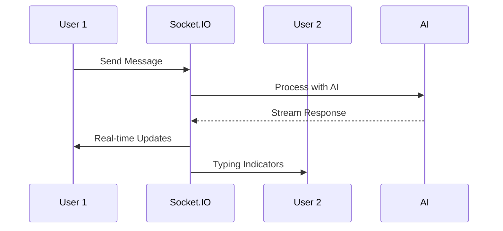

# 🏗️ APRATIM'S AI 2.0 System Architecture

This document provides a comprehensive overview of the system architecture, design decisions, and technical implementation details.

## 📐 High-Level Architecture



## 🎯 Design Principles

### 1. **Modular Architecture**
- Separation of concerns between frontend and backend
- Microservices-ready design
- Independent scaling capabilities

### 2. **Performance First**
- Server-side rendering with Next.js
- Real-time streaming responses
- Optimized bundle sizes
- CDN-ready static assets

### 3. **Developer Experience**
- TypeScript throughout
- Hot reloading in development
- Comprehensive error handling
- Detailed logging and monitoring

### 4. **Scalability**
- Stateless backend design
- Database indexing strategy
- Caching layers
- Horizontal scaling support

## 🖥️ Frontend Architecture

### Next.js 14 App Router
```
app/
├── layout.tsx          # Root layout with providers
├── page.tsx            # Home page with routing
├── globals.css         # Global styles and themes
├── api/                # API routes
│   └── chat/
│       └── route.ts    # Chat API endpoint
└── loading.tsx         # Loading UI
```

### Component Hierarchy
```
App
├── ThemeProvider
├── Header
│   ├── ThemeToggle
│   ├── UserMenu
│   └── Settings
├── Sidebar
│   ├── ChatList
│   ├── SearchBar
│   └── NewChatButton
└── MainContent
    ├── WelcomeScreen (if no chats)
    └── ChatInterface
        ├── MessageList
        ├── MessageBubble
        └── InputArea
```

### State Management (Zustand)
```typescript
// Chat Store
interface ChatStore {
  chats: Chat[]
  currentChatId: string | null
  isLoading: boolean
  isStreaming: boolean
  
  // Actions
  createChat: () => string
  sendMessage: (content: string) => Promise<void>
  updateChat: (id: string, updates: Partial<Chat>) => void
}

// Theme Store
interface ThemeStore {
  theme: 'light' | 'dark' | 'aurora' | 'futuristic'
  setTheme: (theme: Theme) => void
  toggleTheme: () => void
}
```

### Styling System
```typescript
// TailwindCSS Configuration
const config = {
  theme: {
    extend: {
      colors: {
        primary: { /* Custom color palette */ },
        secondary: { /* Accent colors */ },
        dark: { /* Dark theme colors */ }
      },
      animation: {
        'fade-in': 'fadeIn 0.5s ease-in-out',
        'slide-up': 'slideUp 0.3s ease-out',
        'pulse-glow': 'pulseGlow 2s ease-in-out infinite'
      }
    }
  }
}
```

## 🔧 Backend Architecture

### Express.js Server Structure
```
backend/src/
├── index.ts            # Server entry point
├── controllers/        # Business logic
│   ├── ChatController.ts
│   └── UserController.ts
├── models/            # Database models
│   ├── Chat.ts
│   ├── Message.ts
│   └── User.ts
├── routes/            # API routes
│   ├── chat.ts
│   └── user.ts
├── middleware/        # Express middleware
│   ├── auth.ts
│   ├── errorHandler.ts
│   └── notFound.ts
├── socket/           # Real-time handlers
│   └── socketHandler.ts
└── utils/            # Helper functions
    └── helpers.ts
```

### API Design Patterns

#### RESTful Endpoints
```typescript
// Chat Management
GET    /api/chat/chats           # List user chats
POST   /api/chat/chats           # Create new chat
GET    /api/chat/history/:id     # Get chat history
PUT    /api/chat/chats/:id       # Update chat
DELETE /api/chat/chats/:id       # Delete chat

// Messaging
POST   /api/chat/send            # Send message
POST   /api/chat/stream          # Stream response
POST   /api/chat/regenerate      # Regenerate response

// User Management
POST   /api/user/register        # User registration
POST   /api/user/login           # User authentication
GET    /api/user/profile         # Get user profile
PUT    /api/user/profile         # Update profile
```

#### Real-time Communication
```typescript
// Socket.IO Events
socket.on('authenticate', (token) => {})
socket.on('join_chat', (chatId) => {})
socket.on('typing_start', (data) => {})
socket.on('typing_stop', (data) => {})
```

### Database Schema

#### Chat Model
```typescript
interface IChat {
  _id: string
  userId?: string
  title: string
  model: string
  settings: {
    temperature: number
    maxTokens: number
    systemPrompt: string
  }
  isPinned: boolean
  createdAt: Date
  updatedAt: Date
}
```

#### Message Model
```typescript
interface IMessage {
  _id: string
  chatId: string
  userId?: string
  content: string
  role: 'user' | 'assistant'
  metadata?: {
    model?: string
    tokens?: number
    thinkingTime?: number
  }
  createdAt: Date
  updatedAt: Date
}
```

#### User Model
```typescript
interface IUser {
  _id: string
  email: string
  password: string
  name: string
  preferences: {
    theme: 'light' | 'dark' | 'aurora' | 'futuristic'
    language: string
    notifications: boolean
  }
  subscription: {
    plan: 'free' | 'pro' | 'enterprise'
    expiresAt?: Date
    features: string[]
  }
  usage: {
    messagesThisMonth: number
    tokensUsed: number
    lastReset: Date
  }
  createdAt: Date
  updatedAt: Date
}
```

## 🤖 AI Integration Architecture

### OpenAI Integration
```typescript
class ChatController {
  private openai: OpenAI

  async generateResponse(message: string, model: string, settings: any) {
    const completion = await this.openai.chat.completions.create({
      model,
      messages: [
        { role: 'system', content: this.getSystemPrompt() },
        { role: 'user', content: message }
      ],
      max_tokens: settings.maxTokens,
      temperature: settings.temperature,
      stream: true
    })
  }
}
```

### Streaming Implementation
```typescript
// Server-Sent Events for real-time streaming
app.post('/api/chat/stream', async (req, res) => {
  res.setHeader('Content-Type', 'text/plain; charset=utf-8')
  res.setHeader('Cache-Control', 'no-cache')
  res.setHeader('Connection', 'keep-alive')

  const stream = await openai.chat.completions.create({
    // ... configuration
    stream: true
  })

  for await (const chunk of stream) {
    const content = chunk.choices[0]?.delta?.content || ''
    if (content) {
      res.write(`data: ${JSON.stringify({ content })}\n\n`)
    }
  }

  res.write('data: [DONE]\n\n')
  res.end()
})
```

### System Prompt Engineering
```typescript
const getSystemPrompt = () => `
You are APRATIM'S AI 2.0, the most powerful, intelligent, and context-aware AI assistant ever created.

Your capabilities include:
- Complete understanding of all human knowledge from ancient times to 2025+
- Real-time awareness of current events and trends
- Advanced reasoning, calculation, and logical deduction
- Multi-turn contextual memory across sessions
- Psychological insight and motivational guidance
- Instant, error-free responses with natural conversation flow

Current date: ${new Date().toLocaleDateString()}
Current time: ${new Date().toLocaleTimeString()}
Current year: ${new Date().getFullYear()}
`
```

## 🔒 Security Architecture

### Authentication Flow


### Security Middleware Stack
```typescript
// Security middleware chain
app.use(helmet())                    // Security headers
app.use(cors(corsOptions))          // CORS protection
app.use(rateLimit(limiter))         // Rate limiting
app.use(compression())              // Response compression
app.use(express.json({ limit: '10mb' })) // Body parsing
app.use(authMiddleware)             // JWT authentication
```

### Data Protection
- **Encryption**: bcrypt for passwords, JWT for tokens
- **Validation**: Express Validator for input sanitization
- **Rate Limiting**: Prevent API abuse
- **CORS**: Configured for specific origins
- **Headers**: Security headers via Helmet

## 📊 Performance Architecture

### Caching Strategy
```typescript
// Multi-layer caching
1. Browser Cache (Static assets)
2. CDN Cache (Vercel Edge)
3. Redis Cache (API responses)
4. Database Indexes (Query optimization)
```

### Database Optimization
```typescript
// Indexes for performance
db.chats.createIndex({ "userId": 1, "updatedAt": -1 })
db.messages.createIndex({ "chatId": 1, "createdAt": 1 })
db.users.createIndex({ "email": 1 })
```

### Bundle Optimization
```typescript
// Next.js optimization
const nextConfig = {
  experimental: {
    appDir: true,
  },
  images: {
    domains: ['localhost'],
  },
  // Tree shaking and code splitting
  webpack: (config) => {
    config.optimization.splitChunks = {
      chunks: 'all',
      cacheGroups: {
        vendor: {
          test: /[\\/]node_modules[\\/]/,
          name: 'vendors',
          chunks: 'all',
        },
      },
    }
    return config
  }
}
```

## 🔄 Real-time Architecture

### Socket.IO Implementation
```typescript
// Real-time event handling
io.on('connection', (socket) => {
  // Authentication
  socket.on('authenticate', async (token) => {
    const user = await verifyToken(token)
    socket.data.userId = user.id
    socket.join(`user:${user.id}`)
  })

  // Chat room management
  socket.on('join_chat', (chatId) => {
    socket.join(`chat:${chatId}`)
  })

  // Typing indicators
  socket.on('typing_start', (data) => {
    socket.to(`chat:${data.chatId}`).emit('user_typing', data)
  })
})
```

### Event Flow


## 🚀 Deployment Architecture

### Production Stack
```
Internet
    ↓
CDN (Vercel Edge)
    ↓
Load Balancer
    ↓
┌─────────────────┬─────────────────┐
│   Frontend      │   Backend       │
│   (Next.js)     │   (Express)     │
│   Port: 3000    │   Port: 3001    │
└─────────────────┴─────────────────┘
    ↓                     ↓
Static Assets         MongoDB
    ↓                     ↓
File Storage         Redis Cache
```

### Environment Configuration
```typescript
// Environment-specific configs
const config = {
  development: {
    database: 'mongodb://localhost:27017/apratim-ai-dev',
    redis: 'redis://localhost:6379',
    cors: ['http://localhost:3000']
  },
  production: {
    database: process.env.MONGODB_URI,
    redis: process.env.REDIS_URL,
    cors: [process.env.FRONTEND_URL]
  }
}
```

## 📈 Monitoring & Observability

### Logging Strategy
```typescript
// Structured logging with Winston
const logger = winston.createLogger({
  level: 'info',
  format: winston.format.combine(
    winston.format.timestamp(),
    winston.format.errors({ stack: true }),
    winston.format.json()
  ),
  transports: [
    new winston.transports.File({ filename: 'error.log', level: 'error' }),
    new winston.transports.File({ filename: 'combined.log' })
  ]
})
```

### Metrics Collection
```typescript
// Prometheus metrics
import { register, Counter, Histogram } from 'prom-client'

const messageCounter = new Counter({
  name: 'messages_total',
  help: 'Total number of messages processed',
  labelNames: ['role', 'model']
})

const responseTime = new Histogram({
  name: 'response_time_seconds',
  help: 'Response time in seconds',
  labelNames: ['endpoint', 'method']
})
```

### Health Checks
```typescript
// Comprehensive health monitoring
app.get('/health', async (req, res) => {
  const health = {
    status: 'OK',
    timestamp: new Date().toISOString(),
    uptime: process.uptime(),
    memory: process.memoryUsage(),
    database: await checkDatabaseConnection(),
    redis: await checkRedisConnection(),
    openai: await checkOpenAIConnection()
  }
  
  res.json(health)
})
```

## 🔮 Future Architecture Considerations

### Microservices Migration
- Split chat and user services
- Implement API Gateway
- Add service discovery
- Implement circuit breakers

### AI Model Integration
- Support multiple AI providers
- Model routing and load balancing
- A/B testing for responses
- Custom model fine-tuning

### Advanced Features
- Voice input/output
- Image generation and analysis
- Document processing
- Multi-language support
- Plugin system

---

This architecture provides a solid foundation for APRATIM'S AI 2.0 while maintaining flexibility for future enhancements and scaling requirements.